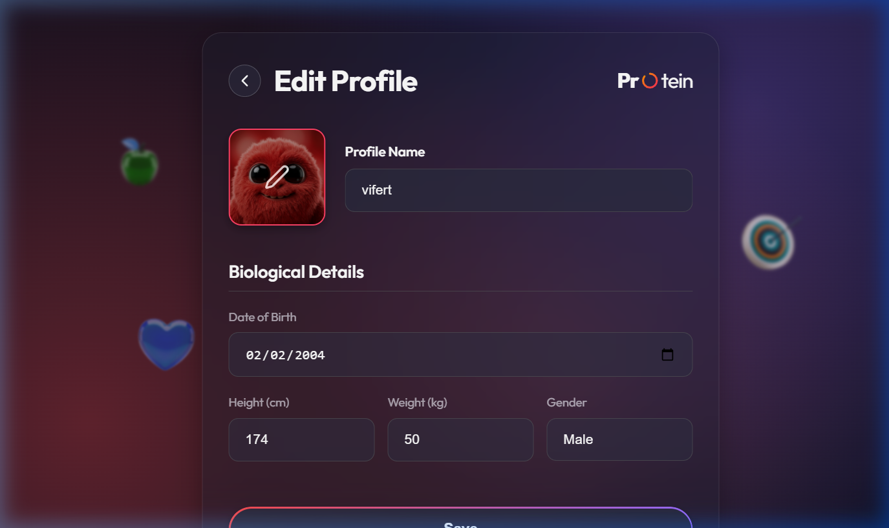
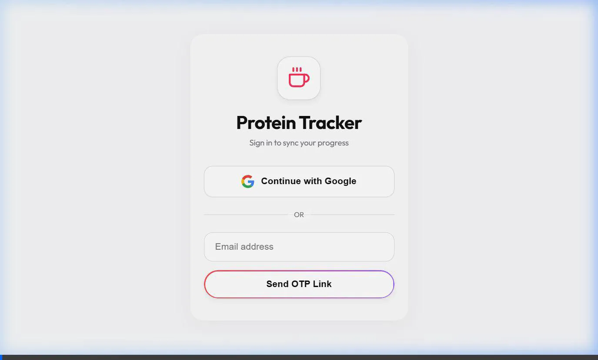

<div align="center">
  
  <h1>Protein Tracker 🚀</h1>

  <p>A premium, glassmorphism-inspired web application designed to help users accurately track their daily protein intake, effortlessly scale macro-goals based on biological profiles, and visualize long-term health trends.</p>

  
  
  
</div>

---

## 📸 Application Walkthrough

<div align="center">
  
  <br/>
  <em>Live Demonstration of Dashboard, Calendar, and Profile Management (Dark Mode)</em>
</div>

---

## ✨ Key Features

- **Personalized Goal Engine:** Automatically calculates your daily protein requirement based on age, height, weight, and gender using the Mifflin-St Jeor equation.
- **Real-time Synchronization:** Built on Firebase Firestore for instant, cross-device data syncing without manual refreshes.
- **Authentication & Security:** Secure Google OAuth and Passwordless Email sign-in flows.
- **Interactive Data Visualization:** Dynamic Area Charts via Recharts for tracking 7-day or 30-day consistency.
- **Power History Tools:** Multi-select actions, bulk deletion, fuzzy searching, and retroactive logging via an intuitive calendar interface.
- **Premium Aesthetics:** Dark/Light mode, transparent glass-panels, custom floating SVG background decorations, and fluid Framer Motion page transitions.
- **Global Timezone Support:** Automatically formats dates and resets daily progress based entirely on the user's localized browser timezone.

## 🛠 Tech Stack

- **Frontend Framework:** React 18, Vite
- **Global State & DB:** Firebase (Firestore, Auth)
- **Routing & Transitions:** React State Modeling + Framer Motion
- **Styling:** Vanilla CSS (CSS Grid, Flexbox, Variable Tokens, Glassmorphism)
- **Icons & Graphics:** Lucide React, Custom SVG Nodes
- **Data Visualization:** Recharts
- **Date Utilities:** date-fns

---

## 🚀 Local Development Setup

Follow these instructions to run the application on your local machine.

### Prerequisites
- Node.js (v16.14.0 or higher)
- npm or yarn
- A Firebase Project (for the Backend Database and Authentication)

### 1. Clone the repository
```bash
git clone https://github.com/your-username/protein-tracker.git
cd protein-tracker
```

### 2. Install Dependencies
```bash
npm install
```

### 3. Setup Environment Variables (`.env`)
The project relies on Firebase. You must supply your own Firebase project configuration keys. 

Create a file named precisely `.env` in the **root** of the directory, and fill in the following template with the keys found in your Firebase Console (`Project Settings` -> `General` -> `Web App`):

```env
VITE_FIREBASE_API_KEY="AIzaSyYourKeyHere..."
VITE_FIREBASE_AUTH_DOMAIN="your-app.firebaseapp.com"
VITE_FIREBASE_PROJECT_ID="your-app"
VITE_FIREBASE_STORAGE_BUCKET="your-app.firebasestorage.app"
VITE_FIREBASE_MESSAGING_SENDER_ID="123456789"
VITE_FIREBASE_APP_ID="1:123456789:web:abcdef..."
VITE_MEASUREMENT_ID="G-XXXXXXXX"
```
*(Note: Do not commit your `.env` file to version control. It is already securely ignored in `.gitignore`)*.

### 4. Enable Firebase Authentication & Firestore
Before starting the app, ensure your Firebase project has:
1. **Firestore Database** enabled (Start in Test Mode or configure proper rules).
2. **Authentication** enabled (Specifically toggle on **Google** and **Email Link** providers).

### 5. Start the Development Server
```bash
npm run dev
```

The application will now be running at `http://localhost:5173`.
